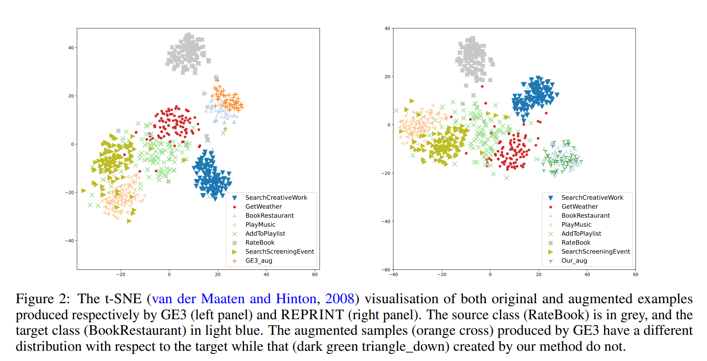

# REPRINT

Implementation for the paper "REPRINT: A RANDOMIZED EXTRAPOLATION BASED ON PRINCIPAL COMPONENTS FOR DATA AUGMENTATION" at [arxiv preprint](https://arxiv.org/abs/2204.12024).

## Abstract

Data scarcity and data imbalance have attracted a lot of attention in many fields. Data augmentation, explored as an effective approach to tackle them, can improve the robustness and efficiency of classification models by generating new samples. This paper presents REPRINT, a simple and effective hidden-space data augmentation method for imbalanced data classification. Given hidden-space representations of samples in each class, REPRINT extrapolates, in a randomized fashion, augmented examples for target class by using subspaces spanned by principal components to summarize distribution structure of both source and target class. Consequently, the examples generated would diversify the target while maintaining the original geometry of target distribution. Besides, this method involves a label refinement component which allows to synthesize new soft labels for augmented examples. Compared with different NLP data augmentation approaches under a range of data imbalanced scenarios on four text classification benchmark, REPRINT shows prominent improvements. Moreover, through comprehensive ablation studies, we show that label refinement is better than label-preserving for augmented examples, and that our method suggests stable and consistent improvements in terms of suitable choices of principal components. Moreover, REPRINT is appealing for its easy-to-use since it contains only one hyperparameter determining the dimension of subspace and requires low computational resource.

## Instructions

This repository uses code from [GE3 software](https://aclanthology.org/attachments/2021.emnlp-main.479.Software.zip). We keep the baseline approaches and append our approach at `utils/augmentation.py`, and provide soft-label version logistic regression at `utils/LogisticRegression_update.py` and `utils/svm.py`. To run our code, you can:

1. Download the dataset and put it in `full-datasets/{DATASET_NAME}_raw` folder, and pre-process it using `pre_clean_{DATASET_NAME}.py`.
2. Create different unbalanced scenario for dataset by modifying `pre_split_imbalance.py` according to the dataset name.
3. Cache the embedding by modifying the pre-trained model or dataset in `1_cache_bert.py` and `utils/bert.py`.
4. Compare different augmentation method in the paper following or changing the settings in `2_train_eval.py`.
